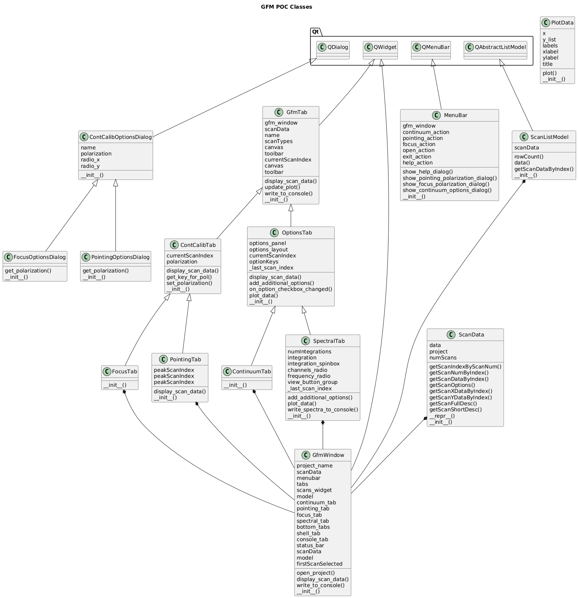
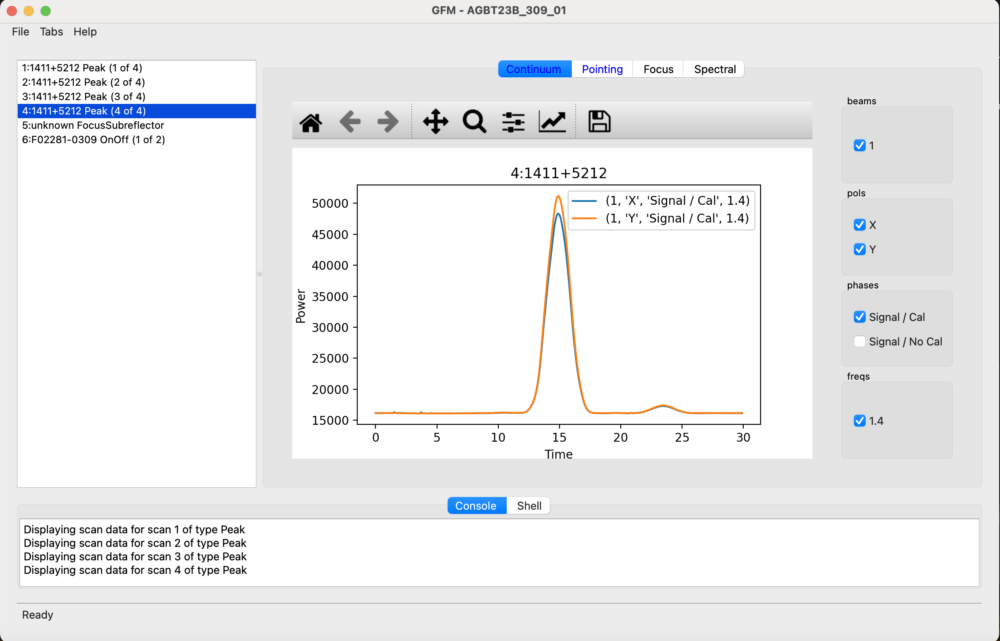
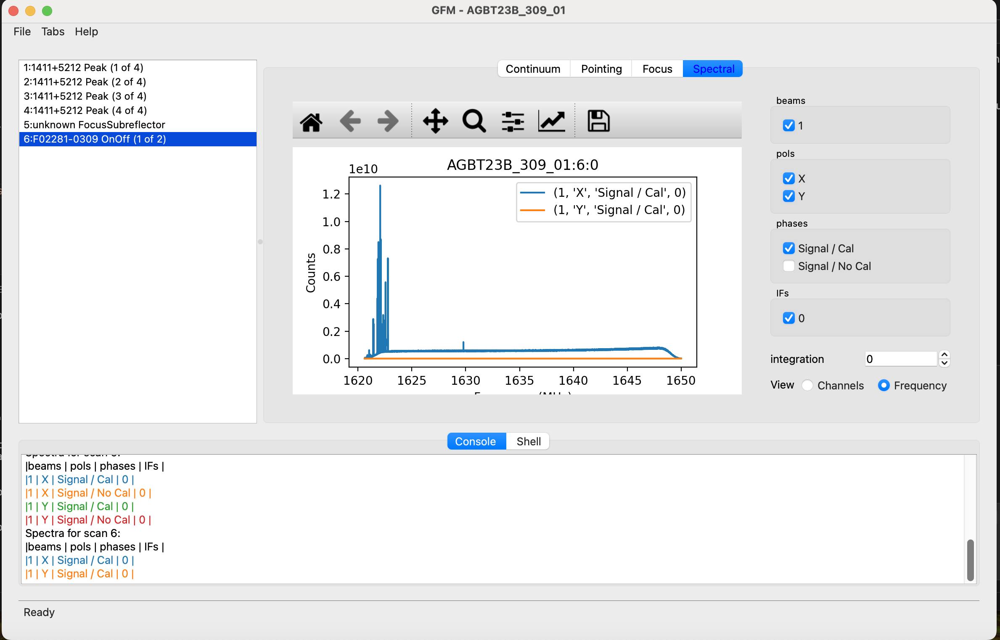
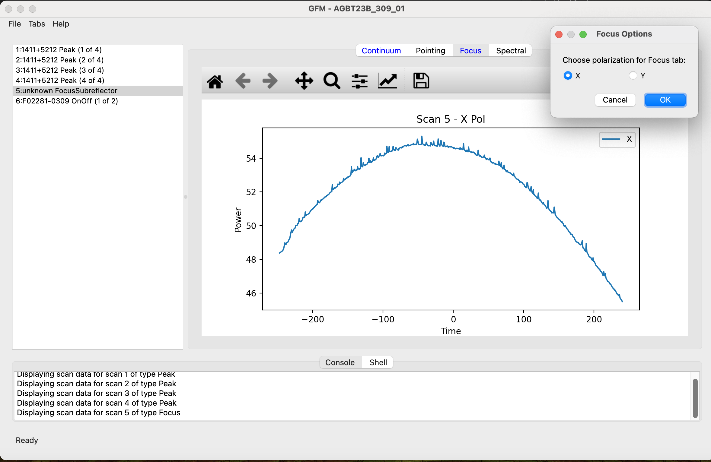
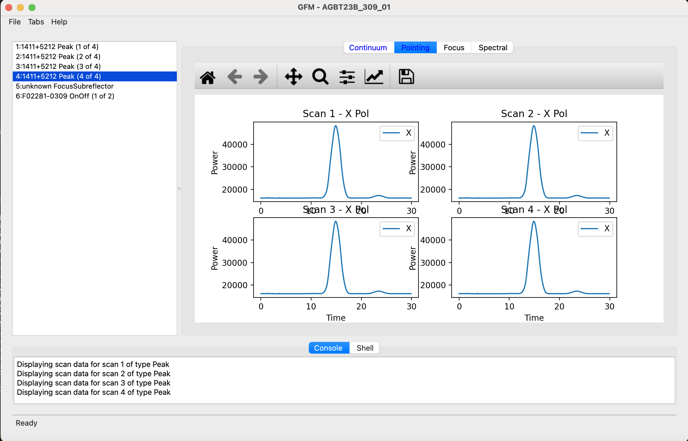

# GFM

This is a simple Python script project created as a starting point.

## Getting Started

- Edit the main Python script to add your code.
- Use the provided Python environment for development.

## Requirements
- Python 3.x
- See `.vscode/settings.json` for environment details if present.

## Running

You can run your script using the Python extension in VS Code or from the terminal:

```sh
python main.py
```

Replace `main.py` with your script name if different.

## Design



## Features

This POC attempts to provide a new UI for all the pertinent features provided by GFM in offline mode.  This includes:
   * loading of project data from project specified at CL
   * scan selection from list
   * all current GFM plugins but OOF

The data for this POC was mocked by loading a pickle file from disk that had data dumped from production GFM.

### Continuum



This is nearly identical to GFM production

### Spectral



This is nearly identical to GFM production, though is missing many of the details provided in the console

### Focus



This is also pretty close to GFM production, but obviously is missing much of the data provided by the real API that we are only mocking here.  LFC's obviously not produced.  The full options are not offered either, as most of them have to do with data processing, but one can see we have included the Polarization option.

### Pointing



This is also pretty close to GFM production, but obviously is missing much of the data provided by the real API that we are only mocking here.  LFC's obviously not produced.  The full options are not offered either, as most of them have to do with data processing, but one can see we have included the Polarization option.

Not visible here in this single screen shot is the way each plot comes up individually at first but then put in the correct quadrant position.